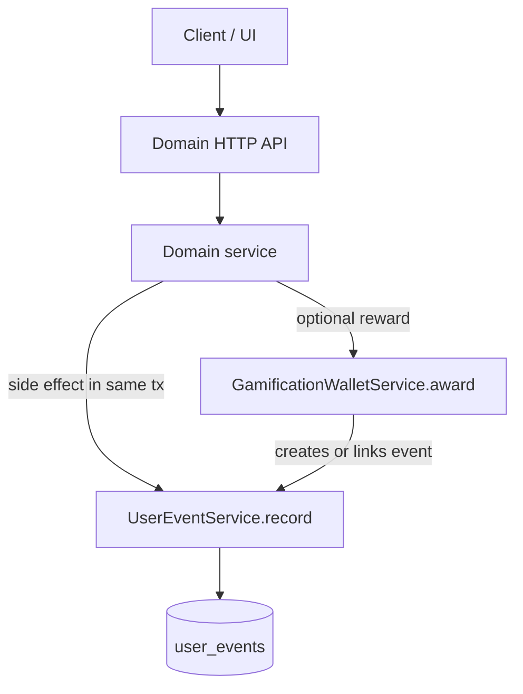
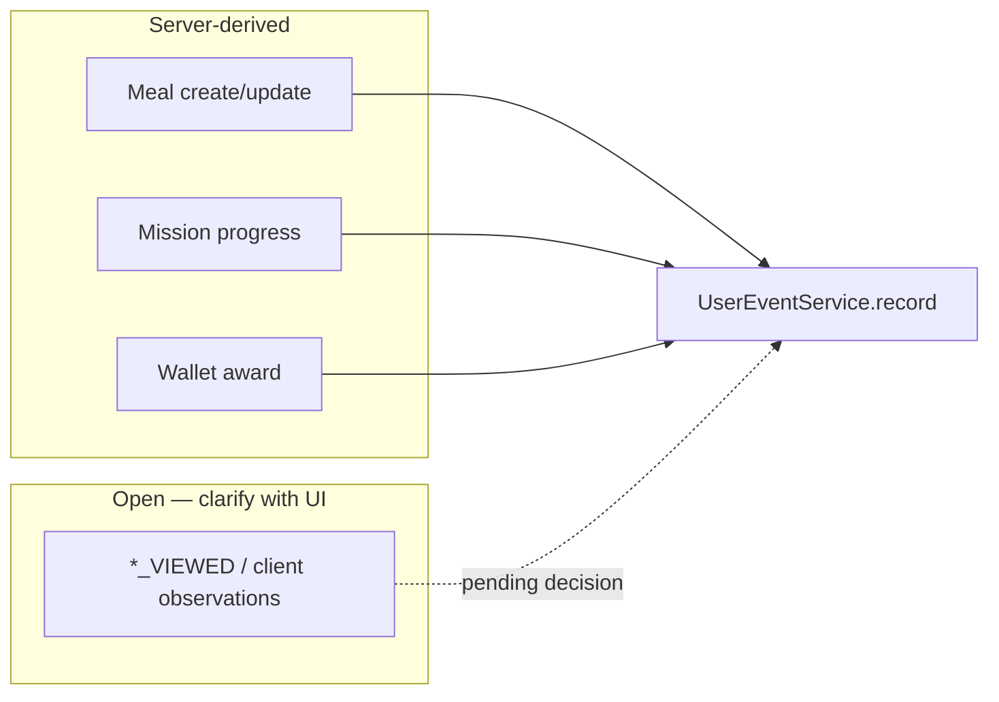

# Event emission guide

How the Foodmission `user_events` ledger works, how events should be emitted as features come online, and what the UI vs API each own.

For the catalog (`EventType`, `EventSource`, `EventSubjectType`) and metadata field conventions, see [`src/events/event-types.ts`](../src/events/event-types.ts).

## Purpose

`UserEvent` is an **append-only, server-owned fact log**: what the user did, when, and in what context. It supports gamification (missions, challenges, wallet) and later analytics over app behaviour.

## How emission works today

There is **no public “post an event” API**. The only writer is [`UserEventService.record()`](../src/events/services/user-event.service.ts). Feature modules import `EventsModule` and call `record` as a side effect of domain work.

### Current producers

| Producer | Event | Notes |
|----------|--------|--------|
| [`GamificationOnboardingService`](../src/gamification/services/gamification-onboarding.service.ts) | `ONBOARDING_COMPLETED` | Same transaction as wallet ensure; idempotency key `onboarding-completed:{userId}` |
| [`GamificationWalletService.award`](../src/gamification/services/gamification-wallet.service.ts) | Default `POINTS_AWARDED` (or caller-supplied type) | Created inside the award transaction, or linked via existing `eventId` |

### Current consumers

- Gamification profile reads recent events ([`GamificationProfileService`](../src/gamification/services/gamification-profile.service.ts)).

### Not wired yet

Mission/challenge progress, meal log, shopping, learning, and the rest of the behavioural catalog. Types exist in the catalog so emitters can be added without schema migrations (`eventType` / `source` are free-form strings in the DB).

## Best practices

1. **Emit as a side effect of a domain write**  
   Prefer deriving the event from a validated mutation (meal saved, progress completed), not from a client-supplied event name.

2. **One writer: `UserEventService.record`**  
   Do not insert into `user_events` from controllers, seeds (except explicit seed tooling with `EventSource.SEED`), or the UI.

3. **Use idempotency for retries and rewards**  
   Stable keys, e.g. `onboarding-completed:{userId}`, `meal-logged:{userId}:{mealId}`, `mission-completed:{userId}:{missionId}`. Concurrent retries should return the existing row (`replayed: true`), not a duplicate fact.

4. **Keep layers separate** (see catalog)  
   - **Behavioural** — evidence (`MEAL_*`, `SWAP_*`, `LEARNING_*`, …)  
   - **Lifecycle** — progress (`MISSION_COMPLETED`, `CHALLENGE_COMPLETED`, `QUEST_*`, …)  
   - **Rewards** — `POINTS_AWARDED` / `XP_AWARDED` via the wallet; link with `eventId` when the behavioural/lifecycle event already exists

5. **`source` = observing feature, not the consumer**  
   Meal log → `EventSource.MEAL_LOG` even if a mission later counts it. Mission completion → `EventSource.MISSION`.

6. **Do not trust the client for trust-sensitive types**  
   Anything that advances missions, awards points, or proves diet/sustainability claims must be server-derived or server-validated.

7. **Metadata is context, not the event kind**  
   Put ids, amounts, tags in `metadata`; put *what happened* in `eventType`. Prefer `subject: { type, id }` via `EventSubjectType` (merged into `metadata.subject`).

## UI vs server

**Default: the UI triggers domain actions; the API records events.** The UI almost never “emits” into this ledger as the source of truth.

| Kind of event | Who records? | Preferred path |
|---------------|--------------|----------------|
| Domain facts with a resource (`MEAL_LOGGED`, shopping tied to a list item, mission complete) | Server | UI calls meal / shopping / mission APIs → service calls `record` |
| Rewards / completion (`POINTS_AWARDED`, `MISSION_COMPLETED`, `CHALLENGE_COMPLETED`) | Server only | Wallet / progress services |
| Product analytics (screen views, funnels) | Not this ledger | Separate analytics tooling |
| Pure “viewed / observed” with no durable domain write | **TBD** | See below |

## Open: `*_VIEWED` and client observations

Catalog types such as `LEARNING_FACT_VIEWED` (and similar “user saw / compared / observed X” without a clear domain write) are **not decided yet**.

**Status:** clarify with the UI team how to track viewed items before wiring emitters or adding an HTTP endpoint.

Possible directions (for discussion only):

1. **Domain “mark viewed” API** — if content is a real resource, UI calls something like `POST /learning/facts/:id/view`; the service records `LEARNING_FACT_VIEWED` with idempotency.
2. **Allowlisted client-report endpoint** — only if there is no durable resource; accept a small allowlist of safe `EventType`s; server stamps `userId`, `source`, and idempotency. Never accept reward or mission-completion types on that path.

Until that discussion lands, keep these types in the catalog but **do not wire them**.

## Catalogue wiring hints (when implementing)

| Family | Emit from |
|--------|-----------|
| Meals, swaps, nutrition, plate-level food waste | Meal-log (or equivalent) service after validating payload / tags |
| Shopping, processing, packaging tied to product or list | Those write paths |
| `MISSION_COMPLETED` / `CHALLENGE_COMPLETED` | Progress services when `completed` transitions to true |
| `POINTS_AWARDED` / `XP_AWARDED` | `GamificationWalletService.award` (link prior event via `eventId` when available) |
| `LOGIN` | Auth / session path on the server (or a controlled hook), not a free-form UI event POST |
| `LEARNING_*_VIEWED` / pure observations | Pending UI clarification (see above) |

## Related code

| Path | Role |
|------|------|
| [`src/events/event-types.ts`](../src/events/event-types.ts) | Catalog + metadata conventions |
| [`src/events/services/user-event.service.ts`](../src/events/services/user-event.service.ts) | `record` / idempotency |
| [`src/events/user-event.utils.ts`](../src/events/user-event.utils.ts) | Subject → `metadata.subject` |
| [`src/events/events.module.ts`](../src/events/events.module.ts) | Nest module to import |
| [`prisma/models/events.prisma`](../prisma/models/events.prisma) | `UserEvent` model → `user_events` |
| [`src/gamification/services/gamification-onboarding.service.ts`](../src/gamification/services/gamification-onboarding.service.ts) | Example lifecycle emitter |
| [`src/gamification/services/gamification-wallet.service.ts`](../src/gamification/services/gamification-wallet.service.ts) | Reward emitter / event link |
