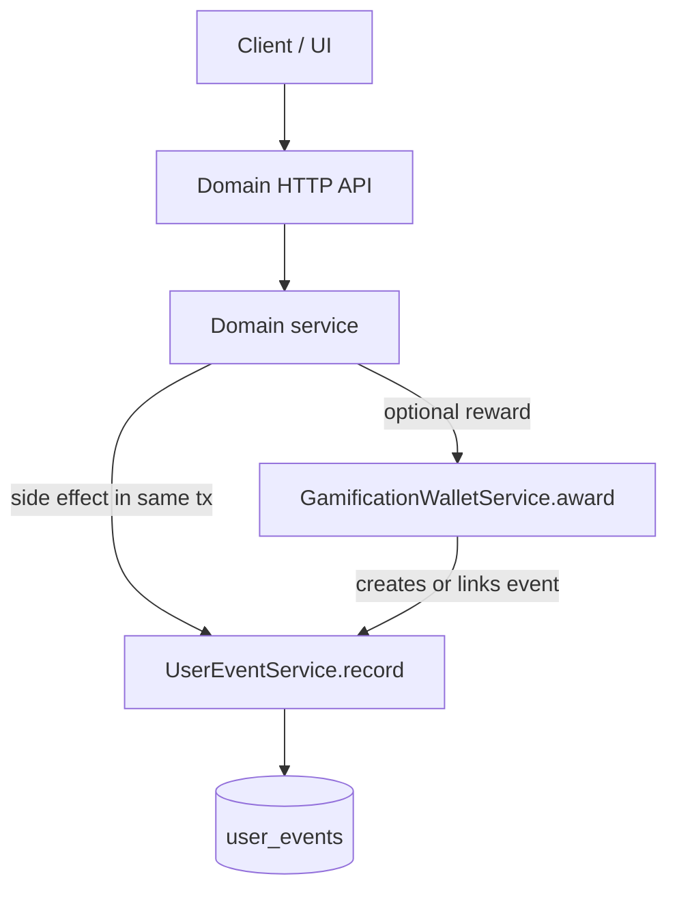

# Event emission guide

How the Foodmission `user_events` ledger works, how events should be emitted as features come online, and what the UI vs API each own.

For the catalog (`EventType`, `EventSource`, `EventSubjectType`) and metadata field conventions, see [`src/events/event-types.ts`](../src/events/event-types.ts).

Catalog domains: **Account**, **App**, **Wallet**, **Progress**, **Achievements**, then behavioural sections **1–8** (meals through learning). Naming: `DOMAIN[_ENTITY]_ACTION`.

## Purpose

`UserEvent` is an **append-only, server-owned fact log**: what the user did, when, and in what context. It supports gamification (missions, challenges, wallet) and later analytics over app behaviour.

## How emission works today

There is **no public “post an event” API**. The only writer is [`UserEventService.record()`](../src/events/services/user-event.service.ts). Feature modules import `EventsModule` and call `record` as a side effect of domain work.

```mermaid
flowchart TD
  client[Client / UI]
  domainAPI[Domain HTTP API]
  domainSvc[Domain service]
  eventSvc[UserEventService.record]
  wallet[GamificationWalletService.award]
  db[(user_events)]

  client --> domainAPI --> domainSvc
  domainSvc -->|"side effect in same tx"| eventSvc --> db
  domainSvc -->|"optional reward"| wallet
  wallet -->|"creates or links event"| eventSvc
```

## Best practices

1. **Emit as a side effect of a domain write**  
   Prefer deriving the event from a validated mutation (meal saved, progress completed), not from a client-supplied event name.

2. **One writer: `UserEventService.record`**  
   Do not insert into `user_events` from controllers, seeds (except explicit seed tooling with `EventSource.SEED`), or the UI.

3. **Use idempotency for retries and rewards**  
   Stable keys, e.g. `onboarding-completed:{userId}`, `meal-logged:{userId}:{mealId}`, `mission-completed:{userId}:{missionId}`. Concurrent retries should return the existing row (`replayed: true`), not a duplicate fact.

4. **Keep domains separate** (see catalog)  
   - **Account** — `USER_LOGGED_IN`, `ONBOARDING_COMPLETED`, `USER_GROUP_JOINED` / `USER_GROUP_LEFT`  
   - **App** — `APP_OPENED` (prefer server-side / authenticated heartbeat with day-level idempotency if used for streaks)  
   - **Behavioural** — evidence (`MEAL_*`, `SWAP_*`, `LEARNING_*`, …)  
   - **Progress** — `MISSION_STARTED` / `MISSION_COMPLETED`, `CHALLENGE_STARTED` / `CHALLENGE_COMPLETED`, `QUEST_*`  
   - **Achievements** — `BADGE_EARNED`, `PROGRESS_INDICATOR_UPDATED`  
   - **Wallet** — `WALLET_POINTS_AWARDED` / `WALLET_XP_AWARDED` / `WALLET_MANUAL_ADJUSTMENT`; link with `eventId` when a behavioural/progress event already exists

5. **`source` = observing feature, not the consumer**  
   Meal log → `EventSource.MEAL_LOG` even if a mission later counts it. Mission completion → `EventSource.MISSION`.

6. **Do not trust the client for trust-sensitive types**  
   Anything that advances missions, awards points, or proves diet/sustainability claims must be server-derived or server-validated.

7. **Metadata is context, not the event kind**  
   Put ids, amounts, tags in `metadata`; put *what happened* in `eventType`. Prefer `subject: { type, id }` via `EventSubjectType` (merged into `metadata.subject`).